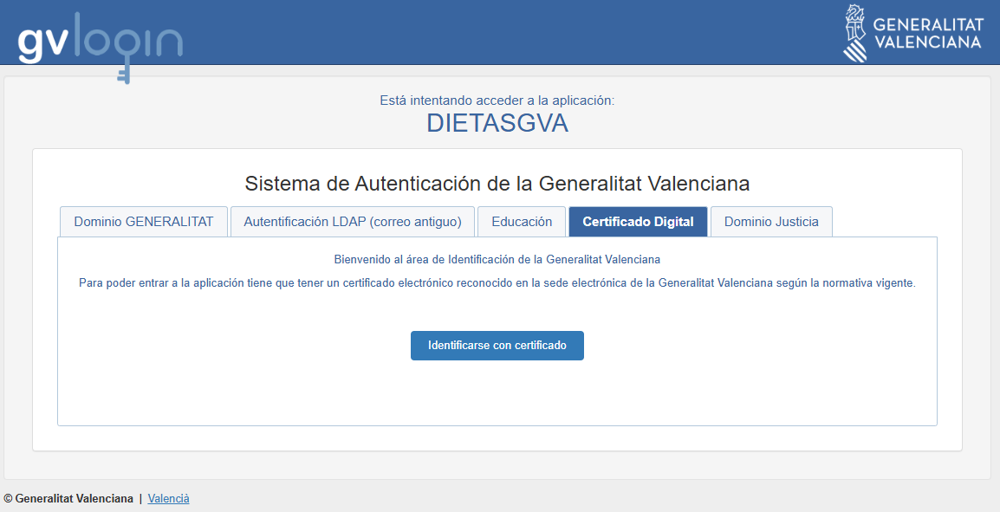
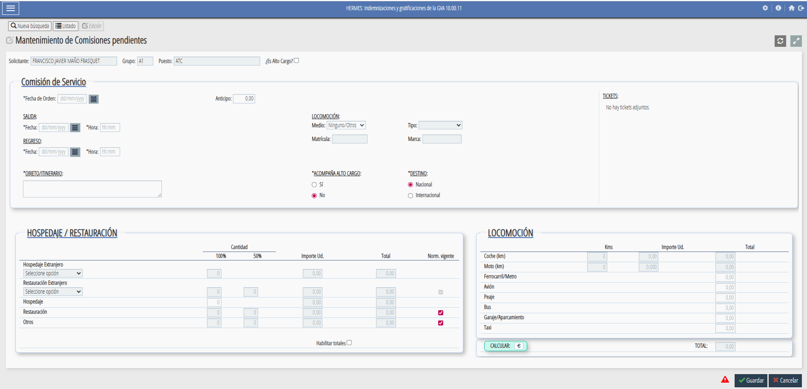
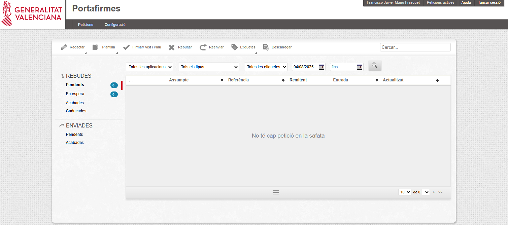
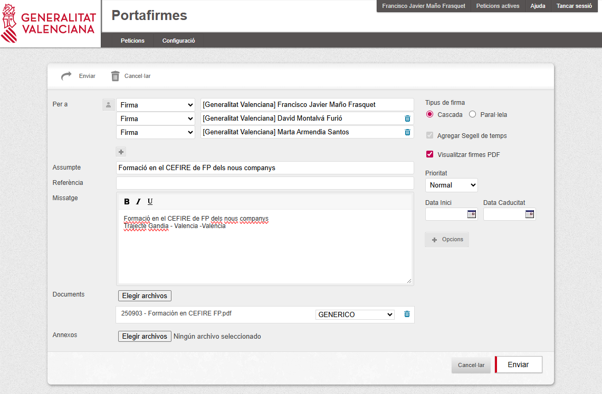

# **Gestió administrativa**

La gestió administrativa és una part fonamental del treball de l’assessor/a, ja que permet organitzar i tramitar correctament totes les activitats i desplaçaments relacionats amb la seva tasca professional. Aquesta secció recull informació sobre **comissions de servei, dietes i despeses de desplaçament**, així com els procediments i documents necessaris.

---

## 📝 Comissions de servei

#### Què són i per a què serveixen

Les **comissions de servei** són autoritzacions temporals que permeten als assessors/des realitzar activitats **fora del seu lloc habitual de treball**, com ara:

* Desplaçaments a centres de FP.
* Assistència a jornades o seminaris.
* Reunions de coordinació amb altres CEFIREs o amb la DGFP.

L’objectiu és garantir que aquests desplaçaments estiguen **formalment autoritzats** i comptin amb la cobertura administrativa i econòmica corresponent.

---

## 💰 Dieta i despeses de desplaçament

#### Normativa

Les dietes i despeses de desplaçament es gestionen segons la **normativa vigent de la Generalitat Valenciana**, que estableix:

* Quantitat diària segons tipus de desplaçament.
* Possibilitat de justificar despeses de transport, allotjament i manutenció.
* Procediment de presentació de documents i justificants.

---

## ⚙️ Procediment pas a pas per a demanar una comissió de servei

1. **Accedir a l’aplicació [GVADietas](https://gvlogin.gva.es/gvlogin/login.xhtml?app=DIETASGVA&url=https%3A%2F%2Fdietasgva.gva.es%2Fdietasgva%2F "GVADietas")**
    - Has d'estar dins de la xarxa de la GVA.
    - T'has de loguejar amb el teu certificat digital.
    {: .center}

2. **Entrar en Indemnizaciones/Comisiones** y polsar buscar per a que aparega el botó de , que polsarem per a crear una nova comissió de servei.  
    {: .center}

3. **Omplirem totes les dades necesaries**
    - És important indicar amb claretat el objecte de la comissió i el itinerari.
    - Cal clicar Norm. vigente
    - Una vegada introduides totes les dades (dates, vehicle, kilometres, etc..), polsarem 
    - I després guardar.  
      
    {: .center}

4. **Imprimirem la autorització** polsant el botó  i ens apareixerà una finestra que tindrem que omplir.  
      
    !!!warning "Atenció"
        Cada assesor/a, haurà d'omplir els camps de la comissió de servei segons indique el director del CEFIRE de FP o el Cap de Servei.

5. **Generarem el pdf que guardarem per a la firma** abans de realitzar el desplaçament.
      
    !!!tip "Recomanació"
        💡 Es recomana guardar una còpia de la comissió aprovada per a qualsevol comprovació posterior.

6. **Ara entrarem en el [Portal de Firmes de GVA](https://portafirmas.gva.es/portafirmas/login "Portal de Firmes GVA")** on ens loguejarem amb el certificat digital  
    {: .center}

7. **Redactem una nova petició**
    - En missatge hem de detallar clarament el motiu de la comissió de servei
    - En firma, deurem de possar les persones que ens han de signar la comissió. Normalment, la signatura anirà en cascada
    - En documents, pugem el pdf de la comissió que hem generat abans
    - Una vegada estiguen tots els camps plens, l'enviem per a signar

    {: .center}

7. S'obri una nova finestra on seleccionarem el nostre nom y polsarem finalitza

8. **Una vegada ja ens hagam desplaçat** haurem de demanar la dieta --> Seguent apartat

## ⚙️ Procediment pas a pas per a demanar una dieta

**PER A COMPLETAR**

---

### Preguntes freqüents

* **Què faig si canvio la data del desplaçament?**
  Cal modificar la comissió existent a l’aplicació i enviar-la novament per a aprovació.

* **Puc fer una comissió per més d’un dia?**
  Sí, sempre indicant les dates exactes i el motiu per cada jornada.

* **Quins documents he de conservar?**
  Sempre guardar còpia de la comissió aprovada i dels justificants de despeses.

---

