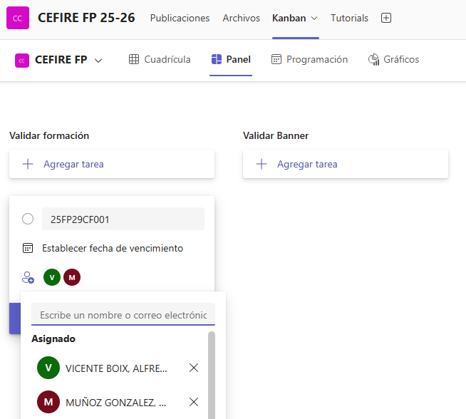
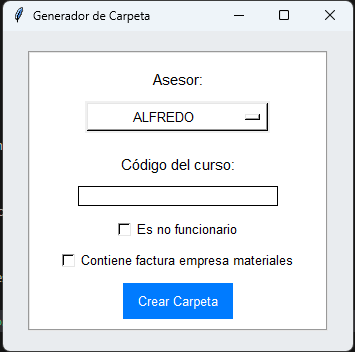
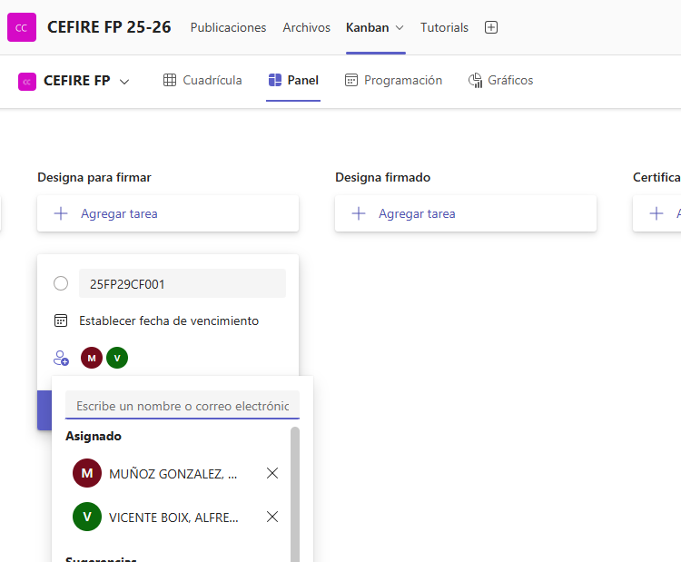

### **Crear el curs en Gesform**
Una vegada tinguen clara la formació i el que necessite caldrà introduïr-la a Gesform. Per a això, caldrà accedir a la plataforma Gesform i donar d'alta la formació. És important que seguisques els passos correctament i que omplis tots els camps necessaris.

[:material-school: Alta Formació en Gesform](../tutorials/tutorial_gesform.md){: .md-button target="_blank"}

Una vegada donat de alta el curs en Gesform ens donarà un codi semblant a 25FPXXCF0XX que l'haurem d'utilitzar per a identificar el curs.  
El curs es quedarà en estat  **INICIAL**, i hem d'avisar a través de **[KANBAN](https://teams.microsoft.com/l/entity/com.microsoft.teamspace.tab.planner/_djb2_msteams_prefix_3021608463?context=%7B%22channelId%22%3A%2219%3A8b16d5e9fb0b4117ab60d2c99b26bf01%40thread.tacv2%22%7D&tenantId=73dd1114-ef7d-40c7-8669-569d32e7e29b){target="_blank"}** que ens validen el curs. Per a fer-ho haurem d'omplir una tasca en la targeta "Validar formación" i assignarem la tasca a Gloria i a Alfredo.  

{: .center} 

---

### **Crear la carpeta i documentació de la formació**

Després d'haurà de crear la carpeta del curs, que s'anomenarà per el codi del curs 25FPXXCF0XX que en haja donat Gesform dins de la carpeta de cursos

 [:material-link-variant: Carpeta de Cursos](https://gvaedu.sharepoint.com/sites/Section_46402871-C/Documentos%20compartidos/Forms/AllItems.aspx?csf=1&web=1&e=3prB4o&CID=ee6b076e%2Dea34%2D452d%2Dab99%2Dc6854dbbb1e6&FolderCTID=0x01200042CD37219C1B3140B8EF4E357167D68D&id=%2Fsites%2FSection%5F46402871%2DC%2FDocumentos%20compartidos%2FCEFIRE%20FP%2025%2D26%2FCARPETAS%20DOC%20CURSOS){: .md-button target="_blank"}

La carpeta creada tindrà una una sèrie de subcarpetes i arxius per a organitzar la documentació del curs. A continuació es resumeixen les subcarpetes i els documments necessaris són els següents:

* **25FPXXCF0XX_FITXA ECONÒMICA.pdf**: Es tracta de la fitxa econòmica del curs, on es detallen els costos i pressupostos. És imprescindible que aquesta fitxa estiga ben omplerta i no tinga cap errada, les errades de esta fitxa **NO ES PODEN CORREGIR** ja que s'inicien procesos que fan difícil corregir els canvis que ací es posen.[Podeu trobar el document ací](https://gvaedu.sharepoint.com/:x:/r/sites/Section_46402871-C/_layouts/15/Doc.aspx?sourcedoc=%7B4EE9E2AD-3CE2-4813-BA8F-37E3A73212C1%7D&file=FITXA%20ECON%25u00d2MICA%20AF_%20GESTI%25u00d3%20ECON%25u00d2MICA_Protocol%201_Punt%206_corr.xlsx&action=default&mobileredirect=true).
* **25FPXXCF0XX_DATOS PONENTE_NOMBRE.pdf**: Es tracta d'un document on es detallen totes les dades del ponent, cal que estiga correctament omplert i que no tinga cap errada. [Podeu trobar el document ací](https://gvaedu.sharepoint.com/:b:/r/sites/Section_46402871-C/Documentos%20compartidos/CEFIRE%20FP%2025-26/DOCUMENTACI%C3%93N%20PARA%20EDICIONES/DOC%20PARA%20PONENTES/DADES%20PONENTS_validat.pdf?csf=1&web=1&e=LRWip3).
* **25FPXXCF0XX_AutorizacionUsoMaterialesAbierto**:Autorització per a l'ús de materials oberts, és un document que cal omplir i signar per part del ponent. [Podeu trobar el document ací](https://gvaedu.sharepoint.com/:b:/r/sites/Section_46402871-C/Documentos%20compartidos/CEFIRE%20FP%2025-26/DOCUMENTACI%C3%93N%20PARA%20EDICIONES/DOC%20PARA%20PONENTES/AutorizacionUsoMaterialesAbierto.pdf?csf=1&web=1&e=mrhuPh).
* **25FPXXCF0XX_AutorizacionGrabacionYDifusion**: Autorització per a la gravació i difusió de la formació, és un document que cal omplir i signar per part del ponent. [Podeu trobar el document ací](https://gvaedu.sharepoint.com/:b:/r/sites/Section_46402871-C/Documentos%20compartidos/CEFIRE%20FP%2025-26/DOCUMENTACI%C3%93N%20PARA%20EDICIONES/DOC%20PARA%20PONENTES/AutorizacionGrabacionYDifusion.pdf?csf=1&web=1&e=3Sx8VL).
* **25FPXXCF0XX_PROPER_PONENTE**: És necessari que el ponent es done d'alta en la plataforma PROPER abans de començar la formació i que vos facilite el document de confirmació d'alta. Comproveu que el número de compte siga el mateix que el de les dades que ha facilitat en la Fitxa DADES PONENTE. 
* **25FPXXCF0XX_Modelo informe necesidad_VAL_V3**: Si el ponent no és funcionari GVA cal fer un informe de perquè estàs fent esta contractació. És cert que no hi ha cap ponent en tota la família professional que no puga impartir el curs, cal justificar-ho. [Podeu trobar el document ací](https://gvaedu.sharepoint.com/:w:/r/sites/Section_46402871-C/Documentos%20compartidos/CEFIRE%20FP%2025-26/DOCUMENTACI%C3%93N%20PARA%20EDICIONES/GESTI%C3%93N%20ECON%C3%93MICA/INFORME%20DE%20NECESIDADES/Informe%20motivado%20de%20necesidad%20de%20ponente%20NO%20FUNCIONARIO%20VAL.docx?d=wd33d83fbf5b74fe2be1626f35b9c61ef&csf=1&web=1&e=xCBwnC).
* **25FPXXCF0XX-Tec**: Cal crear una subcarpeta on es posaran totes les evidències necessàries per a justificar la formació. 
  * **25FPXXCF0XX_CuadroTexto**: Es tracta d'un formulari que cal emplenar.
  * **25FPXXCF0XX_Evidencias**: On es posaran totes les evidències necessàries per a justificar la formació. Baners, publicació en web, fotos, etc...
  * **25FPXXCF0XX_FSE_Ficha_seguimiento**: On es posarà la fitxa de seguiment de la formació.
  * **25FPXXCF0XX_ACTA FINAL.pdf**: Acta amb els APTES i NO APTES de la formació, cal que estiga degudament omplerta i signada per part del ponent, es trau de gesform.
  * **25FPXXCF0XX_ACTA PONENT.pdf**: Acta signada pel ponent on posa els APTES i NO APTES de la formació, la genera ell/a.
  * **25FPXXCF0XX_SIGNATURES.pdf**: Document amb totes les signatures de la formació escanejades.
* **25FPXXCF0XX_DESIGNA_NOM_PONENT_FSE.pdf**: (Convocatòria FSE) Aquest document és necessari per a designar el ponent de la formació, cal que estiga degudament omplert i signat pel cap de servei de formació i orientació i pel subdirector general, caldrà facilitar-lo per la plataforma Kanban que hem habilitat per a que es signe. [Podeu trobar el document ací](https://gvaedu.sharepoint.com/:w:/r/sites/Section_46402871-C/Documentos%20compartidos/CEFIRE%20FP%2025-26/DOCUMENTACI%C3%93N%20PARA%20EDICIONES/GESTI%C3%93N%20ECON%C3%93MICA/DESIGNA_CONFORMIDAD_CERTIFICA/FSE/25FPXXCFXX_DESIGNA_PLANTILLA2.docx?d=wf067d1053ab14cb3996bf711e12c9f2f&csf=1&web=1&e=dXFsre).
* **25FPXXCF0XX_DESIGNA_NOM_PONENT_SKILLS.pdf**: (Convocatòria SKILLS) Aquest document és necessari per a designar el ponent de la formació, cal que estiga degudament omplert i signat pel cap de servei de formació i orientació i pel subdirector general, caldrà facilitar-lo per la plataforma Kanban que hem habilitat per a que es signe. [Podeu trobar el document ací si és docent GVA](https://gvaedu.sharepoint.com/:w:/r/sites/Section_46402871-C/Documentos%20compartidos/CEFIRE%20FP%2025-26/DOCUMENTACI%C3%93N%20PARA%20EDICIONES/GESTI%C3%93N%20ECON%C3%93MICA/DESIGNA_CONFORMIDAD_CERTIFICA/SKILLS/01_DESIGNE_docent_2025_Plantilla.docx?d=w059eaad56517418d924e1ce19f1e95c2&csf=1&web=1&e=T6OpkG). En el cas que no siga docent GVA, caldrà fer un informe de necessitat de contractació i [utilizar aquest document de DESIGNA](https://gvaedu.sharepoint.com/:w:/r/sites/Section_46402871-C/Documentos%20compartidos/CEFIRE%20FP%2025-26/DOCUMENTACI%C3%93N%20PARA%20EDICIONES/GESTI%C3%93N%20ECON%C3%93MICA/DESIGNA_CONFORMIDAD_CERTIFICA/SKILLS/01_Designe_NO_docent_2025_Plantilla.docx?d=wc71a5d088d3f488e8ffc0ba0dc71872d&csf=1&web=1&e=kQcKjr).

#### Aplicació per a crear la carpeta del curs

Hem creat unes aplicacions per a facilitar la creació de carpetes i la pujada de documentació.  
L'ús és molt senzill poseu el vostre nom d'assessor i el codi de la formació i es crearà la carpeta amb totes les subcarpetes necessàries. A més, també es crearà un arxiu de text amb les dades de la formació per a que pugueu omplir-lo amb tota la documentació necessària.  
  
{: .center}

[Aplicació per a crear carpetes de formacions en Windows](../apps/carpeta_curso.exe){: .md-button target="_blank"} [Aplicació per a crear carpetes de formacions en Linux](../apps/crea_cursos_linux){: .md-button target="_blank"}

!!!note "Nota"
    En el cas de l'apliació de Linux cal donar permisos per a executar l'aplicació en Linux.  
    `chmod +x crea_cursos_linux`  

---  

### **Designa**
El **“DESIGNA”** és un document administratiu que serveix per a **formalitzar la designació d’un ponent o formador per a una activitat formativa concreta**, com ara una formació FSE o SKILLS dins del CEFIRE. És una manera oficial de deixar constància que una persona concreta ha estat seleccionada per impartir la formació i que la seva participació està autoritzada i validada per la direcció.

!!!warning "Atenció"
    El Designa es fa en tots els casos menys quan es tracta d'una empresa, que en eixe cas es fa un contracte menor.

Alguns punts clau:

1. **Tipus de convocatòria:** Depenent de si és FSE o SKILLS, hi ha plantilles diferents (per això veus dos documents diferents). En **[Crear la carpeta i documentació de la formació](#crear-la-carpeta-i-documentacio-de-la-formacio)** pots trobar els documents.
2. **Qui l’ha de signar:** El document ha de ser signat pel **cap de servei de formació i orientació** i pel **subdirector general**. Això dóna validesa oficial a la designació.
3. **Kanban:** Una vegada estiga omplit el Designa, hem de pujarlo a la carpeta [DESIGNA POR FIRMAR](https://gvaedu.sharepoint.com/:f:/r/sites/Section_46402871-C/Documentos%20compartidos/CEFIRE%20FP%2025-26/CARPETAS%20DOC%20CURSOS/DESIGNAS%20PARA%20FIRMAR?csf=1&web=1&e=P7o294){target="_blank"} i hem d'avisar a través de [KANBAN](https://teams.microsoft.com/l/entity/com.microsoft.teamspace.tab.planner/_djb2_msteams_prefix_3021608463?context=%7B%22channelId%22%3A%2219%3A8b16d5e9fb0b4117ab60d2c99b26bf01%40thread.tacv2%22%7D&tenantId=73dd1114-ef7d-40c7-8669-569d32e7e29b){target="_blank"}. Per a fer-ho haurem d'omplir una tasca en la targeta "Designa per a firmar" i assignarem la tasca a Gloria i a Alfredo.  

{: .center}

---

### **Fitxa Econòmica**
La **fitxa econòmica** és un document **OBLIGATORI** que s’ha d’elaborar en **TOTS ELS CASOS** quan es crea una acció formativa. És l’eina que assegura la coherència entre la planificació pedagògica i la gestió econòmica del curs, ja que de la seua correcta elaboració dependrà tota la documentació posterior (contractes, justificacions, informes, etc.).

Per això és fonamental que **estiga completada amb rigor i sense errors**, ja que qualsevol incongruència pot generar retards o problemes en el procés de validació i pagament.

**Aspectes clau que cal tindre en compte**

* La fitxa econòmica ha d’estar **correctament emplenada en totes les seues parts**.
* **Tota la documentació administrativa** (contractes, informes, propostes, justificacions…) es genera a partir d’aquesta fitxa, per tant és el **document base**.
* El **pressupost indicat** ha de coincidir **exactament** amb el que s’ha introduït en GESFORM.
* Han d’estar inclosos **tots els noms dels ponents**, sense faltes d’ortografia i amb el **format establit en GESFORM** (majúscules).
* Cal comprovar que hi consten totes les **dades requerides**: hores de docència, tarificació, preu per hora, i el **preu total** de la formació.
* La fitxa econòmica ha d’estar **signada tant per l’assessor/a responsable com pel director/a del CEFIRE**.
* El document s’ha de lliurar en **dos formats**:
    - Excel (editable).
    - PDF signat (versió oficial).  
  

Podeu descarregar la fitxa econòmica des d'ací:

[:gear: Fitxa econòmica](https://gvaedu.sharepoint.com/:x:/r/sites/Section_46402871-C/Documentos%20compartidos/COORDINACI%C3%93N%20DGFP%20CEFIRE%20FP/DOCUMENTACI%C3%93N%20PARA%20EDICIONES/gesti%C3%B3n%20eco/FITXA%20ECON%C3%92MICA%20AF_%20GESTI%C3%93%20ECON%C3%92MICA_Protocol%201_Punt%206_corr.xlsx?d=w4ee9e2ad3ce24813ba8f37e3a73212c1&csf=1&web=1&e=yhrhtq){: .md-button target="_blank"}

---

### **Informe de necessitats**
Quan una formació no és impartida per personal de la **GVA**, és obligatori preparar un **informe de necessitat**, ja que aquest document justifica la contractació i és imprescindible per a tramitar el curs.

* **Si el ponent és personal extern (no funcionari):** cal omplir l’**Informe de necesidades de contratación de no funcionario**.
  [:gear: Model Informe contractació d'un no funcionari](https://gvaedu.sharepoint.com/:w:/r/sites/Section_46402871-C/Documentos%20compartidos/COORDINACI%C3%93N%20DGFP%20CEFIRE%20FP/DOCUMENTACI%C3%93N%20PARA%20EDICIONES/Modelo%20informe%20necesidad_VAL_V3.odt?d=w5ab42620200448968a261acc03d91bbf&csf=1&web=1&e=DyeEUQ){: .md-button target="_blank"}
* **Si es tracta d’una empresa:** s’ha d’elaborar l’**Informe de necessitat per a contracte menor**, signat pel director del CEFIRE.
  [:gear: Model Informe de necessitat per a contracte menor](https://gvaedu.sharepoint.com/:w:/r/sites/Section_46402871-C/Documentos%20compartidos/COORDINACI%C3%93N%20DGFP%20CEFIRE%20FP/DOCUMENTACI%C3%93N%20PARA%20EDICIONES/Modelo%20informe%20necesidad_VAL_V3.odt?d=w5ab42620200448968a261acc03d91bbf&csf=1&web=1&e=g0dYiV){: .md-button target="_blank"}
* **Si la formació requereix material específic** també caldrà omplir un informe de necessitats. Una vegada elaborat crearem una tasca en **[KANBAN](https://teams.microsoft.com/l/entity/com.microsoft.teamspace.tab.planner/_djb2_msteams_prefix_3021608463?context=%7B%22channelId%22%3A%2219%3A8b16d5e9fb0b4117ab60d2c99b26bf01%40thread.tacv2%22%7D&tenantId=73dd1114-ef7d-40c7-8669-569d32e7e29b){target="_blank"}** en la targeta "Informe de necesidades (de material)" i assignarem la tasca a Elena.  

En tots els casos, l’informe ha de ser **coherent amb la fitxa econòmica i la factura proforma** i és un requisit previ a l’autorització.

!!!warning "Atenció"
    Recorda: emplenar l’informe **no implica l’autorització automàtica** de la formació; la decisió final correspon al **Subdirector de Formació del Professorat** i al **Secretari Autonòmic**..

---

### **Banner per a formacions online**
En el cas de les **formacions online**, és obligatori preparar un **banner identificatiu** que s’utilitzarà tant en AULES com en la difusió del curs.

Este banner ha d’incloure de manera clara i visible la informació següent:

* **Codi de la formació**.
* **Nom complet de la formació**.
* **Durada total de la formació (hores)**.
* **Logos institucionals que corresponguen**:

  * CEFIRE de FP
  * Generalitat Valenciana (GVA)
  * Ministeri d’Educació
  * Direcció General de FP
  * Fons Social Europeu (FSE)

És molt important que el banner complisca aquests requisits, ja que és la imatge oficial de la formació i garanteix la correcta visibilitat dels programes i institucions que la recolzen.

#### Aplicació Banners
Podeu utilitzar el següent enllaç per a crear un banner.  
[:material-image-area: Creació de Banners](../apps/baner/proves.html){: .md-button target="_blank"}  

El banner de la formació ha de pujar-se a la carpeta corresponent per a revisar que no tinga cap errada:

[:gear: Carpeta de baners](https://gvaedu.sharepoint.com/:f:/r/sites/Section_46402871-C/Documentos%20compartidos/General/BANNERS%20POR%20PUBLICAR%20EN%20WEB%20CEFIRE?csf=1&web=1&e=QtQ7Lt){: .md-button target="_blank"}

Una vegada creat i pujat a la carpeta de banners crearem una tasca en **[KANBAN](https://teams.microsoft.com/l/entity/com.microsoft.teamspace.tab.planner/_djb2_msteams_prefix_3021608463?context=%7B%22channelId%22%3A%2219%3A8b16d5e9fb0b4117ab60d2c99b26bf01%40thread.tacv2%22%7D&tenantId=73dd1114-ef7d-40c7-8669-569d32e7e29b){target="_blank"}** en la targeta "Validar Banner" i assignarem la tasca a Gloria per a que revise el banner.  

---